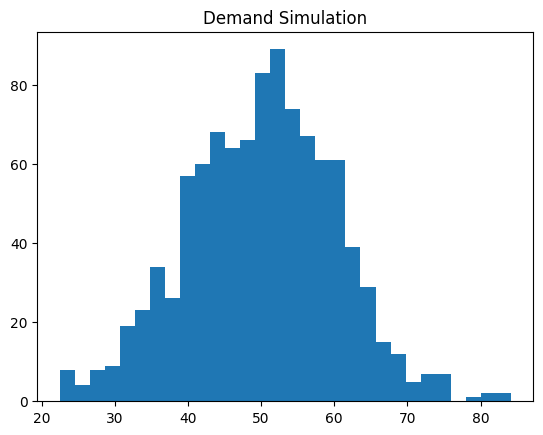
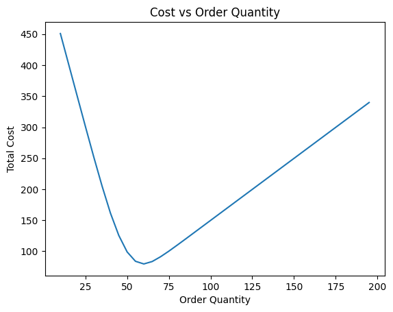

# 📦 AI-Driven Inventory Optimization System

## 🚀 Overview
This project develops a data-driven inventory management system that predicts stockouts and optimizes inventory decisions under demand uncertainty using machine learning, simulation, and optimization techniques.

---

## 🧠 Methodology
- Random Forest for stockout prediction  
- SMOTE for handling imbalanced data  
- Monte Carlo simulation for demand uncertainty  
- Cost optimization for determining optimal order quantity  

---

## 📊 Results
- ✅ Cost reduced by **19.57%**
- 📉 Naive Cost: 98.99  
- 📈 Optimized Cost: 79.61  
- 📦 Reorder Point: 287 units  
- 🛡️ Safety Stock: 37 units  

---

## 📈 Visualizations

### Demand Simulation


### Cost Optimization Curve


---

## 📓 Notebook
Run full analysis:
`inventory_optimization.ipynb`

---

## 💡 Key Insight
The system balances holding and shortage costs to determine optimal inventory policy under uncertain demand.

---

## 🛠️ Tech Stack
- Python  
- Scikit-learn  
- NumPy, Pandas  
- Matplotlib  

---

## ▶️ Run Locally
```bash
pip install -r requirements.txt
jupyter notebook
